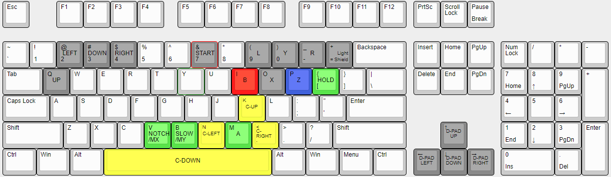

# APRESS-AHK
apress-ahk is an Autohotkey script emulating the experimental Analog Press control scheme through a keyboard within Dolphin. It is a fork of [b0xx-ahk](https://github.com/agirardeau/b0xx-ahk) by agirardeau, which in turn is an adaptation of a [similar script](https://github.com/tlandegger/smashbox-AHK) for Smashbox created by tlandegger.

Analog press is a digital to analog (DTA) input scheme which I created, that aims to make digital controllers more 'analog-like'. You can read about how it works [here](https://github.com/SeamusIngram/analog-press). I wanted to allow people the chance to actually play the game and provide feedback on this control scheme, without needing to buy a DIY controller, since the only other way to play is with my fork of Arte's [pico-rectangle firmware](https://github.com/SeamusIngram/pico-rectangle).

I am unaffiliated with the creators/producers of the B0XX, or the developers of the other keyboard melee options. 

# Requirements

1. Windows. Autohotkey does not run on other platforms unfortunately. This script has been tested on Windows 10.
2. Keyboard with high n-key rollover. N-key rollover determines how many keys can be pressed simultaneously. Most gaming and mechanical keyboards are sufficient in this respect, while most laptop and non-gaming keyboards are not. Some non-gaming keyboards may also allow sufficient simultaneous key presses for only certain keys. Use something like www.keyboardchecker.com to check the behavior of yours.
3. Dolphin. Slippi 2.0.3+ and Faster Melee 5.9F have been tested, other Dolphin versions will probably work as well.
4. vJoy, a joystick emulator. Download and installation instructions are provided under Setup below. 
5. Autohotkey. Other versions of keyboard melee do not require AHK, as you can just run an executable compiled by the author. However, Windows Defender will erroneously flag this version as a threat, meaning you will have to download AHK on your computer to run the script. I did not want to include a file that might cause your antivirus to freak out. You can confirm that it's harmless by looking at the b0xx.ahk file. Setup also below.
6. AHK-CvJoyInterface. This is the library that allows us to use vJoy with the AHK script. Since the script isn't compiled, you will need to download this dependency youself.
# Setup

1. Download vJoy from https://sourceforge.net/projects/vjoystick/?source=typ_redirect. After installing, run "Configure vJoy" (can be found by searching in the start menu). Set the number of buttons to 12 and hit apply.
2. Download Autohotkey from https://www.autohotkey.com. Choose the current version. Now you will be able to run .ahk files without needing to compile into .exe
3. Install AHK-CvJoyInterface, a library for linking Autohotkey and vJoy. Download CvJoyInterface.ahk from https://github.com/evilC/AHK-CvJoyInterface and place it inside Autohotkey's Lib folder (for me this was located at C:\Program Files\AutoHotkey\Lib). Create the Lib folder if it does not already exist. 
4. Place the b0xx-keyboard.ini file inside the \<YourDolphinInstallation\>\User\Config\Profiles\GCPad folder, creating any subfolders that do not already exist. If you're using SmashLadder Dolphin Launcher, your Dolphin instances might be in C:\Users\\\<YourUsername\>\AppData\Roaming\SmashLadder Dolphin Launcher\dolphin_downloads.
5. In Dolphin, open up the controller config. Set player 1 to Standard Controller, then hit configure. Under Profile, select b0xx-keyboard and hit load. Verify that Device is set to DInput/0/vJoy. Hit OK.
6. Place the b0xx.ahk and hotkeys.ini files from this repo in the same directory on your computer. Run b0xx.ahk.

# Configuration

All keybindings are configurable in the GUI. To open it, find the Autohotkey icon in the task bar hidden icons (lil ^ symbol in the system tray lower right -> green H icon) and left click or right click followed by "Edit Controls". Hotkeys can also be edited in hotkeys.ini directly. Changes made in the GUI are immediately saved/reflected in to hotkeys.ini and vice versa.

The default Windows behavior of any keys used can be disabled in the GUI. This is recommended for any meta-keys or keys with system functionality (e.g. shift, ctrl, tab, esc). To disable default behavior, check the "Prevent Default Behavior" box in the GUI next to the appropriate hotkey.

## Using Shift, Control, and Alt

The GUI allows you to bind a hotkey to a meta-key combination such as Shift + W. To bind a hotkey to one of the meta-keys by itself, you must edit hotkeys.ini directly and enter either "Shift", "Ctrl", or "Alt" for the value on the appropriate line. To enter a meta-key combination in hotkeys.ini, precede the appropriate value with "+", "^", or "!" for Shift/Ctrl/Alt respectively (e.g., for Shift + W, enter "+w" in hotkeys.ini).

## hotkeys.ini Index

The numbered lines in hotkeys.ini correspond to the following buttons:

1. Analog Up
2. Analog Down
3. Analog Left
4. Analog Right
5. Notch/ModX
6. Slow/ModY
7. A
8. B
9. L
10. R
11. X
12. Y
13. Z
14. C-Up
15. C-Down
16. C-Left
17. C-Right
18. Light Shield
19. Hold/Mid Shield
20. Start
21. D-Up
22. D-Down
23. D-Left
24. D-Right
25. Debug

# Default Controls

The default layout is chosen to avoid keys that would interfere with normal computer usage (ctrl, tab, enter, etc) or are not present on all keyboards (numpad, F-keys), as well as to work passably on keyboards with poor n-key rollover properties. You can probably find a better layout for you by using additional keys and taking into account your particular hands and keyboard. Some community-sourced suggestions are provided [here](https://raw.githubusercontent.com/agirardeau/b0xx-ahk/master/suggested-layouts.png). 

Note that pressing ModX and ModY together does not turn your C-Stick into the D-pad, like it would on b0xx. Instead, you just have the dedicated buttons. I was too lazy to program in the C-Stick to D-pad functionality

One more thing to note for layouts is that modifier keys and directional inputs should not be pressed with the same fingers. There are situations where you will want to be pressing a direction along with at least one modifier. Therefore, it makes sense to put them on separate fingers. This is relevant because a common layout has medium shield and analog up both pressed by your right pinky, which is not ideal for this scheme. You might need to adjust your layout to find something more comfortable. Also note that you might want to hold slow and hold together, as well as **notch** and **hold**, so it's best not to have them pressed by the same finger, which is why the layout places notch and **slow** by your left thumb. It's not ideal to switch which modifier goes where (ie. don't swap your **notch** and **hold** buttons).

# Troubleshooting

## Error: "\<key\>" is not a valid key name

One of the entries in hotkeys.ini is invalid. Find the line referenced in the error message and set it to something valid.

Some people may get this error despite not having made an invalid change to hotkeys.ini, due to the default value of the debug hotkey being the empty string. If there is no key value between the quotes in the error message, open hotkeys and add a value for the debug hotkey (entry #25).

## Controller behavior is unexpected, or a specific technique doesn't work

* Use www.keyboardchecker.com to make sure all of the required keyboard inputs can be recorded simultaneously on your keyboard.
* Make sure any keys like Shift, Control, Tab, etc have their default behavior disabled in the GUI.
* Try restarting the Autohotkey script.
* In 20XX (or similar), enter debug mode (Start + D-Pad right twice) and turn on controller display (Y + D-Pad left) and analog stick coordinate display (X + D-Pad right, purple numbers). Check whether the expected inputs are being passed from Autohotkey to Melee.
* File an issue on Github.

## Holding left and right continuously causes the character to dashdance, or up and down causes the character to repeatedly jump/fastfall

This is an issue with your keyboard or keyboard driver, since Autohotkey only updates controller inputs when a key is first held or released.

## Holding C-Left and pressing C-Right should cause a rightward smash/aerial, but it doesn't

This is a glitch in melee itself, see: https://imgur.com/a/Tf3eKJQ

# Development Info

## Requirements

Since we install AHK and CvJoyInterface to run the script already, there are no additional requirements to work on the code. Just open b0xx.ahk in your favorite text editor.

## General

After making changes to b0xx.ahk, you can recompile b0xx.exe by right-clicking b0xx.ahk and selecting "Compile Script." Autohotkey must be installed. If your Windows Defender is like mine, you will get a threat warning, and not be allowed to run your .exe
